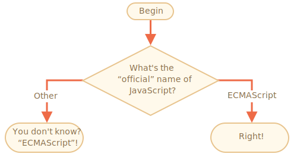

# The name of JavaScript
_`Importance: 5`_

Using the `if..else` construct, write the code which asks: 'What is the "official" name of JavaScript?'

If the visitor enters "ECMAScript", then output "Right!", otherwise -- output: "Didn't know? ECMAScript!"

